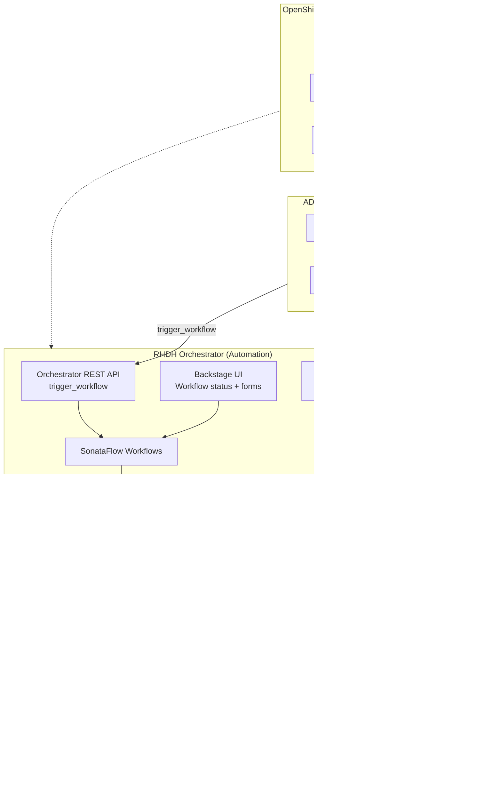
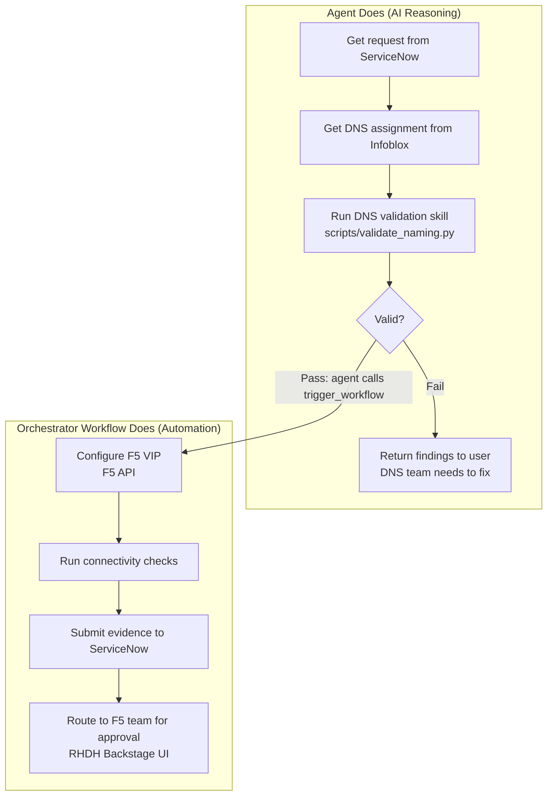
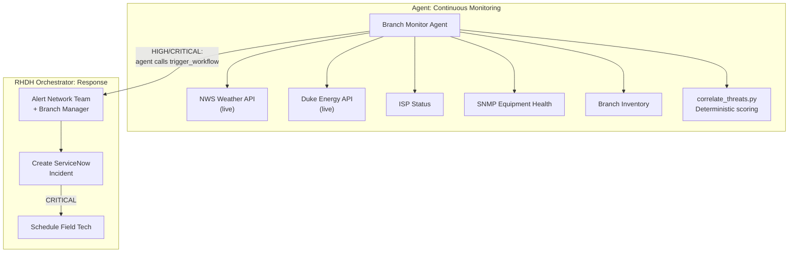
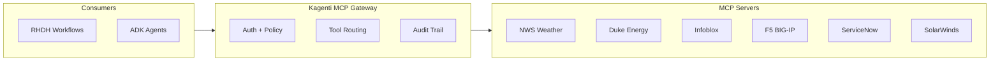

# Network Operations: Agent-Assisted Automation Architecture

## Executive Summary

Two network operations use cases transformed by combining workflow automation with AI agents:

1. **F5 VIP Provisioning** -- reduces provisioning cycle from 6 weeks to days by automating the workflow, adding AI-powered DNS validation to catch assignment errors before configuration, and generating evidence packages for approval.

2. **Proactive Branch/ATM Monitoring** -- shifts from reactive to proactive operations by deploying an AI agent that correlates weather, power, ISP, and equipment data to predict and alert on potential outages before they impact branches.

---

## Architectural Principle

Three layers, each doing what it's best at:

**Key: The agent calls the orchestrator, not the other way around.**

| Layer | Technology | Role |
|-------|-----------|------|
| **AI Reasoning** | Google ADK Agent + agentskills.io | Owns the intelligence: DNS validation, threat correlation, evidence synthesis. Decides WHEN to trigger workflows. |
| **Workflow Automation** | RHDH Orchestrator (SonataFlow) | Owns deterministic steps: F5 config, alert routing, ticket creation, approval gates. Triggered BY the agent. |
| **Tool Access** | RHDH MCP Server + Kagenti MCP Gateway | Agent uses RHDH MCP for catalog/docs. Both agent and workflow use MCP Gateway for external systems. |
| **Platform** | OpenShift AI + Red Hat Agent Operator | Lifecycle, security (Keycloak + SPIFFE/SPIRE), observability |

---

## Use Case 1: F5 VIP Provisioning

### Current State

| Step | Owner | Duration | Issues |
|------|-------|----------|--------|
| Platform team opens ServiceNow request | Platform Team | Day 1 | Manual |
| Network engineering reviews | Network Team | Week 1-2 | Queue delays |
| DNS team assigns IPs | DNS Team | Week 2-3 | **IPs often wrong** |
| Cisco CMS implements in change window | CMS Team | Week 4-6 | **Uses wrong IPs, multiple correction cycles** |
| Total | | **6 weeks to months** | |

### Target State

### Where AI Adds Value (vs Pure Automation)

| Stage | Type | Why Agent, Not Script |
|-------|------|----------------------|
| DNS/IP Validation | **Agent** | Pattern recognition against naming conventions, historical comparison, subnet environment cross-reference |
| Evidence Synthesis | **Agent** | Assembles multi-stage outputs into human-readable approval report, detects anomalies |
| All other stages | **Automation** | Deterministic: API calls, config application, connectivity checks, ticket updates |

### Agent Skills

**`f5-dns-validator` skill** includes an executable validation script (`scripts/validate_naming.py`) that performs deterministic rule checking. The LLM interprets results and provides context:

- Hostname environment suffix validation (.prod. vs .stg.)
- IP subnet prefix matching per environment
- VLAN range verification
- Conflicting environment indicators
- Historical pattern comparison

### Impact

| Metric | Before | After |
|--------|--------|-------|
| Provisioning time | 6 weeks to months | Days |
| Correction cycles | Multiple | Caught before configuration |
| Evidence documentation | Manual, inconsistent | Automated, structured |
| DNS error rate | High | Flagged before reaching F5 |

---

## Use Case 2: Proactive Branch/ATM Network Monitoring

### Current State

- Network team is **reactive**, not proactive
- Branch staff sometimes drive to branches to discover issues
- Delays in response to power failures, ISP outages, equipment malfunctions
- No correlation between external events (weather, power) and branch impact

### Target State

### Data Sources

| Source | API | Status | Data |
|--------|-----|--------|------|
| **NWS Weather** | `api.weather.gov` | **Live (free, public)** | Severe weather alerts by county |
| **Duke Energy** | ArcGIS public API | **Live (free, public)** | Power outage status by ZIP |
| ISP Status | Downdetector / StatusPage | Mock (needs subscription) | Service degradation by region |
| Equipment Health | SolarWinds / SNMP | Mock (needs internal access) | Link status, latency, UPS battery |
| Branch Inventory | Internal database | Mock (needs internal access) | Locations, ISPs, contacts |

### Threat Scoring

The agent uses an **executable script** (`correlate_threats.py`) for deterministic scoring -- the LLM does not compute the score:

| Factor | Weight | Source |
|--------|--------|--------|
| Weather severity | 0-40 | NWS alerts |
| Power outage | 0-30 | Utility APIs |
| ISP degradation | 0-20 | ISP status |
| Equipment health | 0-10 | SNMP monitoring |

| Threat Level | Score | Response |
|-------------|-------|----------|
| **CRITICAL** (80+) | High across multiple factors | Alert all + incident + dispatch tech |
| **HIGH** (60-79) | Significant risk | Alert team + manager + incident |
| **MEDIUM** (40-59) | Moderate risk | Alert team only |
| **LOW** (0-39) | Normal operations | Log, no action |

### Example Scenario

> **Agent assessment**: Severe thunderstorm warning for Mecklenburg County, NC. Duke Energy reports 3,200 customers without power in ZIP 28202. AT&T Business shows degraded service in Charlotte (145ms latency, 4.2% packet loss). Branch BR-4471 primary link degraded, backup ISP on standby. ATM cluster ATM-28202-A has NO backup ISP and only 20 minutes UPS runtime.
>
> **Threat: CRITICAL for ATM-28202-A** (score 82), **HIGH for BR-4471** (score 72)
>
> **Actions taken**: Alerted charlotte-netops team, notified branch manager Sarah Chen, created ServiceNow incidents INC-2025-05-4471 (P2) and INC-2025-05-202A (P1), recommended field tech dispatch with portable hotspot for ATM cluster.

### Impact

| Metric | Before | After |
|--------|--------|-------|
| Detection | Reactive (after outage) | Proactive (before impact) |
| Branch visits | Drive to discover | Pre-alerted, targeted |
| Mean time to respond | Hours | Minutes |
| ATM downtime | Unknown until reported | Predicted and mitigated |

---

## MCP Gateway: Unified Tool Layer

Both workflows and agents access external systems through the Kagenti MCP Gateway:

**Benefits:**
- Single access point for both workflows and agents
- Auth enforcement per tool (Keycloak tokens)
- Complete audit trail of every tool call
- Tool discovery via MCP protocol
- Add new tools without changing workflow or agent code

---

## Technology Stack

| Component | Technology | Purpose |
|-----------|-----------|---------|
| Agent Framework | Google ADK | Agent construction, tool registration, A2A serving |
| Agent Skills | agentskills.io | Portable methodology + domain knowledge + executable scripts |
| Workflow Engine | RHDH Orchestrator (SonataFlow) | Deterministic workflow orchestration |
| Developer Portal | Red Hat Developer Hub (Backstage) | Workflow UI, approval gates, status tracking |
| Tool Protocol | MCP (Model Context Protocol) | Agent-to-tool communication |
| Agent Protocol | A2A (Agent-to-Agent) | Agent discovery and invocation |
| Platform | OpenShift AI | Container orchestration, networking |
| Agent Operations | Red Hat Agent Operator (Kagenti) | Agent lifecycle, security, observability |
| Identity | Keycloak + SPIFFE/SPIRE | OAuth2/OIDC + workload identity |
| LLM Inference | LlamaStack + Gemini 2.5 Flash | Model serving |
| Observability | OTel + MLflow | Tracing, evaluation |

---

## Implementation Phases

### Phase 1: Agent POCs (Completed)
- Branch Monitor agent with live NWS + Duke Energy APIs
- F5 DNS Validator agent with executable naming validation script
- 30 unit tests passing, both agents construct and tools verified

### Phase 2: RHDH Orchestrator Integration
- Deploy SonataFlow workflows on RHDH
- Wire A2A calls from workflow to agents
- Wire MCP calls from workflow to tools
- Backstage UI for operator visibility and approval gates

### Phase 3: MCP Server Development
- Build real MCP servers wrapping internal systems
- Deploy through Kagenti MCP Gateway
- Configure auth and policy per tool

### Phase 4: Production Hardening
- Red Hat Agent Operator integration (SPIFFE/SPIRE, AuthBridge)
- MLflow tracing for agent observability
- Agent evals for quality regression testing
- Shadow mode deployment alongside existing process
